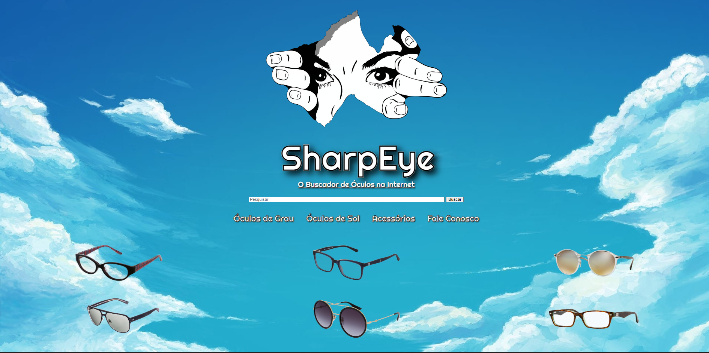

# SharpEye - Buscador de Óculos na Internet

Link do projeto: https://sharpeye.netlify.app

## Descrição
É um buscador que encontra na internet as opções de óticas que fornecem venda de óculos tanto de grau quanto óculos de sol e seus acessórios na internet. Neste projeto eu tinha em mente um site onde pudesse localizar na web e juntar as possíveis óticas que fornecessem a venda de óculos online, seja de grau ou de sol. O maior desafio seria o óculos de grau por que necessitaria de receita e medida da posição dos olhos, por isso são algumas óticas que fornecem esse serviço online. 

## Desafios
Principal desafio será aplicar o Grid e algo dinânimo usando o JavaScript, uma vez que estou buscando sair um pouco do HTML e CSS. Estou tendo dificuldades para deixar a página responsiva para mobile, estou procurando uma solução para isso e em breve atualizarei o projeto. Fiz este projeto com algo em mente que eu nunca vi por aí, geralmente é assim que começo os meus projetos. Este site eu fiz pensando em uma página inicial somente, porém além da estrutura do HTML e o estilo do CSS eu quis manipular um pouco do Grid que nunca tinha aplicado e principalmente adicionar algum efeito no java Script, pois nunca tinha feito ainda em um projeto.
## Objetivos
Melhorar minhas habilidades do CSS e começar a aplicar linhas de código do JavaScript. Ou seja, criar uma página inicial que tem efeitos em JavaScript e com imagem posicionadas usando o Grid.
## Ferramentas Utilizadas
- HTML
- CSS (Grid, Flexbox)
- JavaScript (efeito de fade in nas imágens e máquina de escrever no título e subtítulo do site)
